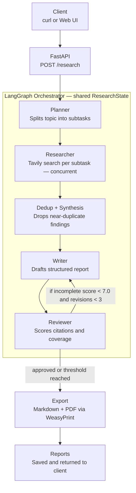

# AI Research Assistant

A multi-agent research pipeline that turns a topic into a structured, cited research report — exported as Markdown and PDF.

---

## Overview

Submit a research topic via API or web UI. The system runs a five-stage agentic pipeline orchestrated by LangGraph:

1. **Planner** — breaks the topic into 3–5 focused sub-questions using Gemini
2. **Researcher** — runs concurrent Tavily web searches for each sub-question
3. **Dedup** — drops near-duplicate findings using Google embedding cosine similarity
4. **Writer** — drafts a structured report with inline citations using Gemini
5. **Reviewer** — scores the draft, checks plan coverage, and sends it back for revision if needed

Results are saved as `.md` and `.pdf` files and returned via JSON response.

---

## Architecture




---

## Features

- **Automated research planning** — Gemini decomposes any topic into targeted sub-questions
- **Multi-source web search** — Tavily searches run concurrently across all sub-questions (3 results each)
- **Semantic deduplication** — Google `gemini-embedding-001` embeddings + cosine similarity (threshold: 0.92) remove redundant findings before writing
- **Structured report generation** — every report contains exactly: Executive Summary, Key Findings, Detailed Analysis, Conclusion, References
- **APA-style citations** — inline `[N]` references with formatted References section
- **Export to Markdown and PDF** — files are timestamped, slugified, and persisted to `reports/`
- **Quality review loop** — Reviewer scores drafts on 5 dimensions; revision triggered when score < 7.0, capped at 3 cycles

---

## Tech Stack

| Layer | Technology |
|---|---|
| API | FastAPI 0.141 |
| Agent orchestration | LangGraph 1.2 |
| LLM + embeddings | Gemini 2.5 Flash via `langchain-google-genai` |
| Web search | Tavily via `langchain-tavily` |
| PDF rendering | WeasyPrint 69 |
| Containerisation | Docker + Docker Compose |
| Language | Python 3.11 (Docker) / 3.14 (local dev) |

---

## Setup

### Prerequisites

- Python 3.11+
- [uv](https://docs.astral.sh/uv/) (recommended) or pip
- A [Google AI Studio](https://aistudio.google.com/) API key
- A [Tavily](https://tavily.com/) API key

### 1. Clone

```bash
git clone https://github.com/Diwash17/AI-Research-Assistant.git
cd AI-Research-Assistant/research-agent
```

### 2. Configure environment

```bash
cp .env.example .env
```

Edit `.env` and fill in your keys:

```
GOOGLE_API_KEY=your_google_api_key_here
TAVILY_API_KEY=your_tavily_api_key_here
```

### 3a. Run locally

```bash
uv venv
source .venv/bin/activate
uv pip install -r requirements.txt
uvicorn app.main:app --reload
```

### 3b. Run with Docker

```bash
docker-compose up --build
```

The server starts at `http://localhost:8000` either way.

---

## Usage

### curl

```bash
curl -X POST http://localhost:8000/research \
  -H "Content-Type: application/json" \
  -d '{"topic": "Impact of remote work on small team productivity"}'
```

### Response

```json
{
  "report_id": "impact-of-remote-work-on-small-team-productivity",
  "markdown_url": "/reports/impact-of-remote-work-on-small-team-productivity-20260811-094512.md",
  "pdf_url": "/reports/impact-of-remote-work-on-small-team-productivity-20260811-094512.pdf",
  "summary": "## Executive Summary\n\nRemote work has fundamentally reshaped how small teams operate. Studies from 2022–2025 consistently show productivity gains of 13–20% for knowledge workers, though outcomes vary significantly by team size, management style, and task type..."
}
```

Download the files directly:

```bash
curl http://localhost:8000/reports/impact-of-remote-work-on-small-team-productivity-20260811-094512.pdf -o report.pdf
```

---

## API Reference

| Method | Endpoint | Description |
|---|---|---|
| `GET` | `/health` | Liveness check — returns `{"status": "ok"}` |
| `POST` | `/research` | Run the full pipeline for a topic |
| `GET` | `/reports/<filename>` | Download a generated `.md` or `.pdf` file |
| `GET` | `/` | Web UI (form-based interface) |
| `GET` | `/docs` | Swagger UI — interactive API explorer |

### POST /research

**Request body:**
```json
{ "topic": "string" }
```

**Response:**
```json
{
  "report_id": "string",
  "markdown_url": "/reports/<slug>-<timestamp>.md",
  "pdf_url": "/reports/<slug>-<timestamp>.pdf",
  "summary": "first ~300 chars of report"
}
```

**Errors:** returns `422` for empty topic, `500` with `{"detail": "..."}` on pipeline failure.

---

## Web UI

Open `http://localhost:8000` after starting the server. The form at `static/index.html` lets you enter a topic, shows rotating status messages during the 1–3 minute pipeline run, and displays download links on completion.

---

## Project Structure

```
research-agent/
├── app/
│   ├── agents/
│   │   ├── planner.py       # topic → subtask list via Gemini
│   │   ├── researcher.py    # concurrent Tavily search
│   │   ├── dedup.py         # embedding-based deduplication
│   │   ├── writer.py        # report drafting + citations
│   │   └── reviewer.py      # structured scoring + plan coverage check
│   ├── api/
│   │   └── routes.py        # FastAPI endpoints
│   ├── export/
│   │   ├── markdown_builder.py   # save timestamped .md files
│   │   └── pdf_exporter.py       # WeasyPrint .md → .pdf
│   ├── graph/
│   │   ├── state.py         # ResearchState TypedDict
│   │   └── workflow.py      # LangGraph DAG — compiled research_graph
│   ├── schemas/
│   │   └── models.py        # Finding (Pydantic) + ResearchState (TypedDict)
│   ├── tools/
│   │   └── tavily_search.py # TavilySearch factory (get_tavily_tool)
│   ├── config.py            # env loading, get_llm() factory
│   └── main.py              # FastAPI app, static mounts
├── static/
│   └── index.html           # single-file web UI
├── reports/                 # generated .md and .pdf files (gitignored)
├── Dockerfile
├── docker-compose.yml
├── requirements.txt
└── .env.example
```

---

## Notes

**Revision loop** — after the Writer produces a draft, the Reviewer scores it across five dimensions (completeness, evidence, citation format, readability, factual consistency) and checks that every planned subtask is addressed. If the overall score is below `7.0` and no hard cap has been reached, the draft is sent back for revision. The loop is capped at `MAX_REVISIONS = 3` to prevent infinite cycles. A score ≥ 7.0 accepts the draft even if the Reviewer hasn't formally approved it.

**Deduplication threshold** — findings with cosine similarity above `SIMILARITY_THRESHOLD = 0.92` (using `gemini-embedding-001` embeddings) are dropped, keeping the first occurrence. Tune this constant in `app/agents/dedup.py` if you want stricter or looser deduplication.

**Pipeline duration** — expect 1–3 minutes per request. The bottleneck is sequential LLM calls (plan → write → review) plus concurrent Tavily searches. The web UI shows cosmetic status messages to indicate progress.
